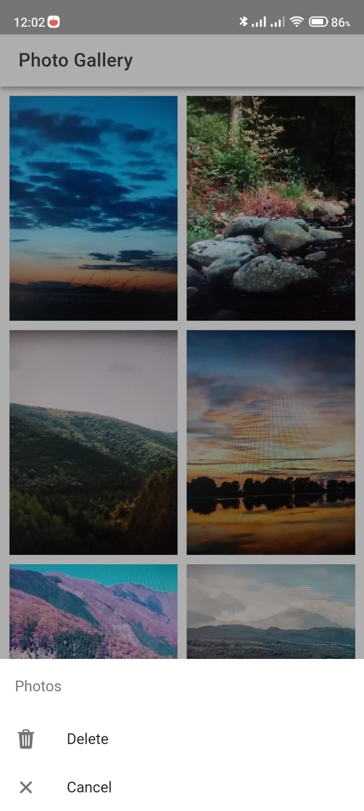

# ionic-angular-photo-gallery-app
Bem-vindo ao **Ionic Angular Photo Gallery App**! Este é um aplicativo de galeria de fotos interativo e moderno, desenvolvido utilizando as poderosas tecnologias Ionic e Angular. O aplicativo permite que os usuários capturem imagens diretamente de seus dispositivos móveis ou câmeras web e as exibam de forma elegante em uma galeria visualmente atrativa.

## Recursos Principais

- Captura de fotos com apenas um toque, seja em dispositivos móveis ou navegadores web.
- Exibição em tempo real das imagens capturadas, organizadas em um layout de galeria intuitivo.
- Integração perfeita dos frameworks Ionic e Angular para uma experiência de desenvolvimento eficiente e consistente.
- Interface responsiva e amigável que se adapta a diferentes dispositivos e tamanhos de tela.
- Interação simples e intuitiva para explorar imagens e navegar pela galeria.
- Uma oportunidade perfeita para aprender as melhores práticas de desenvolvimento utilizando duas das principais tecnologias para aplicativos móveis e web.

## Como Iniciar

1. Clone este repositório para sua máquina local.
2. Navegue até o diretório do projeto: `cd ionic-angular-photo-gallery-app`
3. Instale as dependências: `npm install`
4. Execute o aplicativo: `ionic serve`

## Contribuições

Contribuições são bem-vindas! Se você tem melhorias ou novos recursos para sugerir, sinta-se à vontade para abrir um problema ou enviar uma solicitação de pull.

## Licença

Este projeto está licenciado sob a [Licença MIT](LICENSE).

## Fonte do Projeto

Este projeto é baseado na documentação oficial do Ionic, especificamente no tutorial "Your First Ionic App: Angular". Para mais detalhes, consulte a [Documentação Oficial do Ionic](https://ionicframework.com/docs/angular/your-first-app).

## Capturas de Tela

> Esta é a tela inicial do aplicativo, onde os usuários podem explorar as opções.

> Na galeria de imagens, os usuários podem ver as fotos capturadas em uma visualização agradável.

> Os usuários têm a opção de deletar imagens da galeria, proporcionando controle sobre suas fotos.

> O menu de opções oferece uma variedade de ações para os usuários, permitindo personalização e navegação.

> A primeira vez que os usuários abrem o aplicativo, são guiados através de uma experiência de uso simples.

---

Explore a poderosa combinação de Ionic e Angular enquanto cria uma experiência única e envolvente de galeria de fotos. Ideal para desenvolvedores que desejam aprofundar seus conhecimentos em desenvolvimento móvel e web moderno.

Criado por [witorsather]
